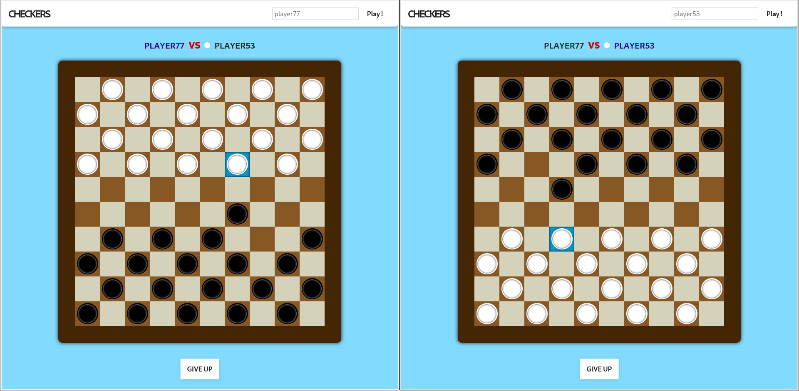

# CHECKERS

Repository: *checkers*  
Type of challenge: *learning*  
Duration: *1 week*  
Deployment strategy: *[Heroku](https://checkersio.herokuapp.com/)*  
Team challenge : *solo*

## What I use :
* Front-End: React.js
* Back-End: Node.js, Socket.io

## Objectives
Objectives were to create a multiplayer checker game with React.js as a client.
